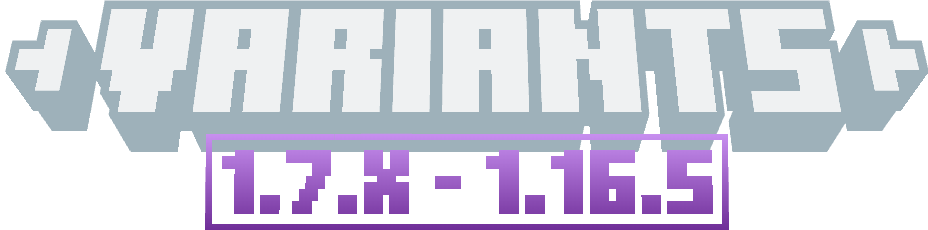

# 
 - Variants - 

 For Variants 1.20.2 — 3.X 

Variants adds various variants of items, blocks, and features from Minecraft.

This branch of the project is for NeoForge 1.20.2, and was my first time using NeoForge and, in fact, updating to 1.20.2.

Currently, this branch includes features everything from at least update 1.6.15, and includes needed features from newer updates:
- Basically just **Chest Boats** (untextured with no items, that is).
